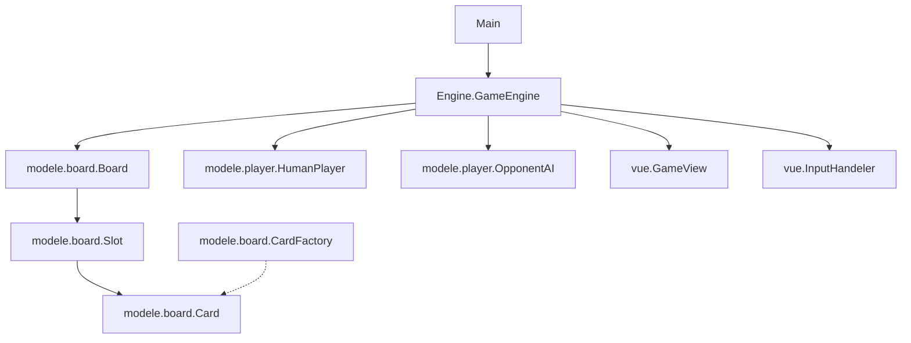

# 👁️ Inscryption — Adaptation Java Console (Architecture MVC)

[](https://www.oracle.com/java/)
[](https://junit.org/junit5/)
[]()

Cette application est une implémentation logicielle orientée objet en **Java 17** du jeu de cartes tactique **Inscryption**. Le projet a été conçu selon des principes rigoureux de conception logicielle (patterns MVC, Factory, polymorphisme) pour garantir l'extensibilité, la testabilité et une séparation stricte des responsabilités.

---

## 🏗️ Architecture Logicielle & Design Patterns

Le système est structuré autour du patron d'architecture **Modèle-Vue-Contrôleur (MVC)** pour découpler l'état du jeu, la logique métier, et l'interface utilisateur en mode console.



### 1. Le Modèle (`modele`)
Contient l'état de l'application et la logique métier pure, sans aucune dépendance envers l'affichage ou les entrées utilisateur.
* **Hiérarchie des Cartes (Polymorphisme)** : 
  * [Card](file:///home/nexxo/project-inscryption/src/modele/board/Card.java) (classe abstraite de base) définit les propriétés communes (nom, points de vie actuels et maximaux).
  * [AnimalCard](file:///home/nexxo/project-inscryption/src/modele/board/AnimalCard.java) étend `Card` en y ajoutant les attributs d'attaque, les capacités de vol, et les coûts d'invocation (Sang / Os).
  * [ObstacleCard](file:///home/nexxo/project-inscryption/src/modele/board/ObstacleCard.java) représente les éléments de décor destructibles du plateau.
* **Gestion du Plateau** : 
  * [Board](file:///home/nexxo/project-inscryption/src/modele/board/Board.java) encapsule une matrice de $3 \times 4$ instances de [Slot](file:///home/nexxo/project-inscryption/src/modele/board/Slot.java) modélisant la file d'attente adverse, la ligne active adverse et la ligne du joueur.
* **Structures de Données des Joueurs** :
  * [Player](file:///home/nexxo/project-inscryption/src/modele/player/Player.java) gère les agrégations de cartes via [Deck](file:///home/nexxo/project-inscryption/src/modele/player/Deck.java), [Hand](file:///home/nexxo/project-inscryption/src/modele/player/Hand.java), et [Graves](file:///home/nexxo/project-inscryption/src/modele/player/Graves.java) (cimetière servant au calcul de la ressource d'Os).
* **Pattern Factory** :
  * [CardFactory](file:///home/nexxo/project-inscryption/src/modele/board/CardFactory.java) centralise l'instanciation des cartes d'animaux et d'obstacles sous forme d'objets immuables ou configurés à la volée.

### 2. Le Contrôleur (`Engine`)
* [GameEngine](file:///home/nexxo/project-inscryption/src/Engine/GameEngine.java) orchestrateur principal. Il orchestre la boucle de jeu, la gestion des tours de table, l'exécution séquentielle de la phase d'attaque (calcul des dégâts directs vs combat de cartes), et la résolution des capacités spéciales (comme le vol des créatures).

### 3. La Vue (`vue`)
* [GameView](file:///home/nexxo/project-inscryption/src/vue/GameView.java) : Responsable du rendu visuel ASCII dans le terminal. Reçoit le modèle en lecture seule et formate les cartes sous forme de blocs de chaînes pour un affichage aligné.
* [InputHandeler](file:///home/nexxo/project-inscryption/src/vue/InputHandeler.java) : Gère la capture des entrées au clavier (`Scanner`), effectue des validations de format par expressions régulières et lève des alertes explicites en cas de saisie invalide (ex: coordonnées de plateau hors limites ou cartes inexistantes en main).

---

## 🛠️ Spécifications Techniques & Capacités Spéciales

Les règles de combat intègrent des comportements spécifiques implémentés via des drapeaux d'états et de la logique conditionnelle lors des phases d'attaque :
* **Dégâts Directs et Excessifs** : Si un emplacement faisant face à une carte attaquante est vide, l'attaque affecte directement l'objet [Score](file:///home/nexxo/project-inscryption/src/modele/Score.java). En cas de destruction d'une carte adverse par excès de dégâts, le surplus est reporté sur le score.
* **Capacité Volant** : Court-circuite la vérification de présence de carte sur le slot adverse, appliquant les dégâts directement au score.
* **Ressources d'Invocation** : 
  * Gestion dynamique des sacrifices via la sélection d'indices de slots joueurs et libération des ressources associées.
  * Suivi incrémental du cimetière (`Graves`) pour alimenter le compteur de ressources osseuses.

---

## ⚙️ Compilation et Exécution

### Prérequis
* **JDK 17** ou supérieur installé.

### Processus de Build
Pour compiler les fichiers sources Java sans dépendre d'un système de build tiers :
* **Linux / macOS** :
  ```bash
  javac -d out $(find src -name "*.java")
  ```
* **Windows** :
  ```cmd
  dir /s /b src\*.java > sources_src.txt
  javac -d out @sources_src.txt
  ```

### Exécution du Moteur
Démarrez l'application principale via la JVM :
```bash
java -cp out Main
```

### Tests Unitaires
Les cas de test (attaques, calcul du score, distribution des cartes et pioches, sacrifices) sont validés sous **JUnit 5**. Ils peuvent être exécutés directement au sein de votre IDE (comme **IntelliJ IDEA**) configuré avec les librairies d'exécution JUnit Jupiter.

---

## 📊 Diagrammes de Conception
Des diagrammes de classes UML au format PlantUML sont disponibles dans le dossier `uml/` afin de tracer l'évolution du modèle au cours des phases de développement (voir notamment `uml/semaine4.puml`).
